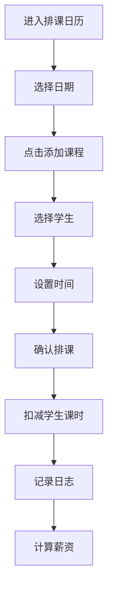

## 1. 产品概述
一款专为教育培训机构设计的排课管理小程序，帮助老师高效管理课程安排、学生课时余额和薪资计算。
- 解决培训机构手动排课繁琐、课时统计困难、薪资计算复杂的问题
- 目标用户：培训机构老师、课程顾问

## 2. 核心功能

### 2.1 用户角色
| 角色 | 注册方式 | 核心权限 |
|------|----------|----------|
| 老师 | 系统默认 | 排课、查看学生课时、查看薪资统计 |

### 2.2 功能模块
1. **首页/排课日历**：显示每日课时安排、排课详情、操作日志
2. **学生管理**：学生列表、课时余额查看、费用设置
3. **批量排课**：选择多位学生批量安排课程
4. **薪资统计**：当日/当月薪资自动计算

### 2.3 学生类型
| 类型 | 名称 | 说明 | 课时处理 |
|------|------|------|----------|
| prepaid | 预付费学生 | 提前购买一定数量课时 | 排课后自动扣减剩余课时 |
| postpaid | 后付费学生 | 上完课再结算费用 | 不扣课时，记录费用待结算 |

### 2.4 页面详情
| 页面名称 | 模块名称 | 功能描述 |
|----------|----------|----------|
| 排课日历 | 日历视图 | 按日期查看排课，点击日期显示当日课程列表 |
| 排课日历 | 课程卡片 | 显示每节课的学生、时间、费用信息，区分学生类型 |
| 排课日历 | 添加课程 | 点击空白时段添加单节课，根据学生类型处理 |
| 排课日历 | 操作日志 | 显示近期排课、扣课时操作记录 |
| 学生管理 | 学生列表 | 显示所有学生姓名、类型标签、剩余课时、每节课费用 |
| 学生管理 | 学生详情 | 点击学生查看详细信息、课时变动记录、待结算费用 |
| 学生管理 | 编辑学生 | 修改学生类型、课时数、每节课费用 |
| 批量排课 | 学生选择 | 多选学生进行批量排课，支持按类型筛选 |
| 批量排课 | 时间设置 | 设置课程日期、时间段 |
| 薪资统计 | 当日统计 | 显示当天授课收入总额（含已结算和待结算） |
| 薪资统计 | 当月统计 | 显示当月累计收入总额 |
| 薪资统计 | 明细列表 | 显示每日收入明细，区分预付费和后付费 |

## 3. 核心流程

### 3.1 排课流程
用户进入排课日历 → 选择日期 → 点击添加课程 → 选择学生 → 设置时间 → 确认排课 → 自动扣减学生课时 → 记录日志

### 3.2 批量排课流程
进入批量排课 → 勾选多位学生 → 设置课程日期和时间 → 确认批量排课 → 逐个扣减学生课时 → 记录日志

### 3.3 查看学生课时流程
进入学生管理 → 点击学生卡片 → 查看剩余课时和课时变动记录

### 3.4 薪资计算流程
系统自动根据每节课费用累加 → 实时计算当日/当月薪资

## 4. 用户界面设计

### 4.1 设计风格
- 主色调：专业深蓝色 (#1e3a5f)，辅以清新绿色 (#22c55e) 表示成功状态
- 按钮风格：圆角矩形，主色背景白色文字，悬停有渐变效果
- 字体：使用系统字体，标题加粗，内容清晰可读
- 布局风格：卡片式布局，信息层级分明
- 图标：简洁线性图标

### 4.2 页面设计概述
| 页面名称 | 模块名称 | UI元素 |
|----------|----------|--------|
| 排课日历 | 日历头部 | 月份切换、日期选择、今日标记 |
| 排课日历 | 课程列表 | 时间轴布局、课程卡片、颜色区分 |
| 排课日历 | 操作日志 | 时间戳、操作类型、操作内容 |
| 学生管理 | 学生卡片 | 头像占位、姓名、剩余课时标签、费用标签 |
| 学生管理 | 学生详情弹窗 | 详细信息、课时变动记录列表 |
| 批量排课 | 选择面板 | 学生复选框、全选按钮、已选数量 |
| 批量排课 | 时间设置 | 日期选择器、时间选择器 |
| 薪资统计 | 统计卡片 | 金额显示、趋势箭头、占比图表 |

### 4.3 响应式设计
- 桌面端：完整日历视图，多列布局
- 移动端：单列布局，日历简化为日期选择器

### 4.4 交互设计
- 点击日历日期高亮并切换课程列表
- 添加课程时弹出表单，选择学生后自动带入费用信息
- 学生卡片点击展开详情弹窗
- 批量排课时显示已选学生数量和预估总课时
