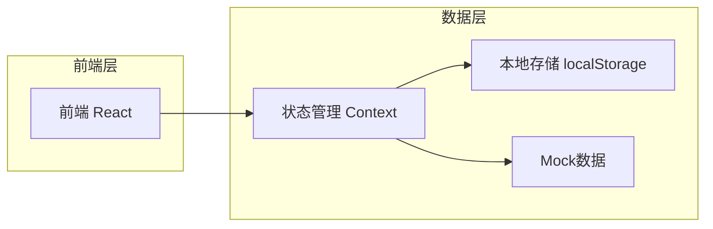
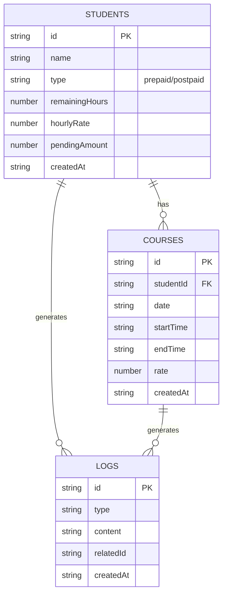

## 1. 架构设计



## 2. 技术选型
- 前端框架：React@18 + TypeScript
- 构建工具：Vite@6
- 样式框架：TailwindCSS@3
- 图标库：Lucide React
- 状态管理：React Context + useReducer
- 数据持久化：localStorage
- 路由：React Router DOM

## 3. 路由定义
| 路由 | 用途 |
|------|------|
| / | 首页 - 排课日历 |
| /students | 学生管理页面 |
| /batch-schedule | 批量排课页面 |
| /salary | 薪资统计页面 |

## 4. API定义（前端模拟）

### 4.1 课程接口
| 方法 | 路径 | 功能 |
|------|------|------|
| GET | /api/courses | 获取所有课程列表 |
| POST | /api/courses | 添加新课程 |
| DELETE | /api/courses/:id | 删除课程 |

### 4.2 学生接口
| 方法 | 路径 | 功能 |
|------|------|------|
| GET | /api/students | 获取学生列表 |
| POST | /api/students | 添加新学生 |
| PUT | /api/students/:id | 更新学生信息 |
| DELETE | /api/students/:id | 删除学生 |

### 4.3 日志接口
| 方法 | 路径 | 功能 |
|------|------|------|
| GET | /api/logs | 获取操作日志 |

## 5. 数据模型

### 5.1 ER图



### 5.2 数据类型定义

```typescript
type StudentType = 'prepaid' | 'postpaid';

interface Student {
  id: string;
  name: string;
  type: StudentType;
  remainingHours: number;
  hourlyRate: number;
  pendingAmount: number;
  createdAt: string;
}

interface Course {
  id: string;
  studentId: string;
  date: string;
  startTime: string;
  endTime: string;
  rate: number;
  createdAt: string;
}

interface Log {
  id: string;
  type: 'schedule' | 'hour_deduct' | 'hour_refund' | 'student_add' | 'student_edit';
  content: string;
  relatedId: string;
  createdAt: string;
}
```

## 6. 项目结构

```
src/
├── components/          # 通用组件
│   ├── Layout.tsx       # 布局组件
│   ├── Sidebar.tsx      # 侧边栏导航
│   ├── Header.tsx       # 顶部导航
│   └── Modal.tsx        # 弹窗组件
├── pages/               # 页面组件
│   ├── Calendar.tsx     # 排课日历页
│   ├── Students.tsx     # 学生管理页
│   ├── BatchSchedule.tsx # 批量排课页
│   └── Salary.tsx       # 薪资统计页
├── contexts/            # Context状态管理
│   └── AppContext.tsx   # 全局状态
├── hooks/               # 自定义hooks
│   └── useLocalStorage.ts # localStorage操作
├── data/                # Mock数据
│   └── mockData.ts      # 初始数据
├── types/               # 类型定义
│   └── index.ts         # 全局类型
├── utils/               # 工具函数
│   ├── format.ts        # 格式化工具
│   └── storage.ts       # 存储工具
├── App.tsx              # 根组件
├── main.tsx             # 入口文件
└── index.css            # 全局样式
```

## 7. 状态管理设计

### 7.1 AppContext State
```typescript
interface AppState {
  students: Student[];
  courses: Course[];
  logs: Log[];
  selectedDate: string;
}
```

### 7.2 Actions
- `ADD_STUDENT`: 添加学生
- `UPDATE_STUDENT`: 更新学生信息
- `DELETE_STUDENT`: 删除学生
- `ADD_COURSE`: 添加课程（自动扣课时）
- `DELETE_COURSE`: 删除课程（自动返还课时）
- `ADD_BATCH_COURSES`: 批量添加课程
- `ADD_LOG`: 添加操作日志
- `SET_SELECTED_DATE`: 设置选中日期

## 8. 关键功能实现

### 8.1 课时扣减逻辑
添加课程时，根据学生ID查找学生，减少1课时，同时记录日志

### 8.2 薪资计算逻辑
- 当日薪资：筛选当日所有课程，累加每节课的rate
- 当月薪资：筛选当月所有课程，累加每节课的rate

### 8.3 批量排课逻辑
遍历选中学生列表，为每位学生创建课程记录，逐个扣减课时

### 8.4 数据持久化
每次状态变更后，自动同步到localStorage
